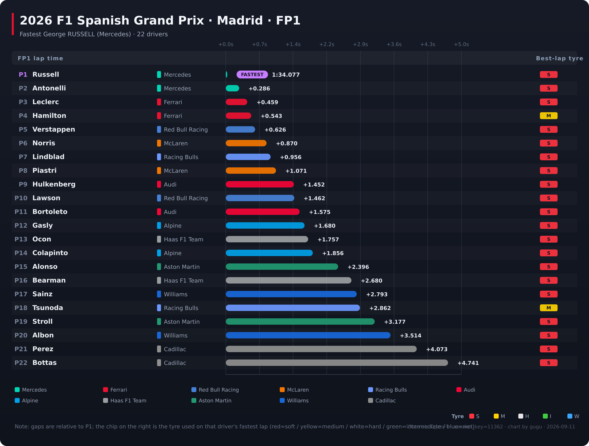
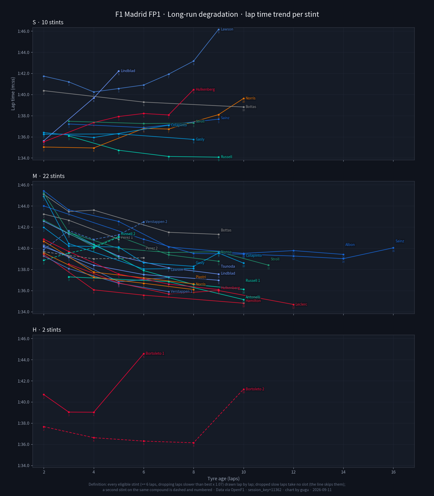
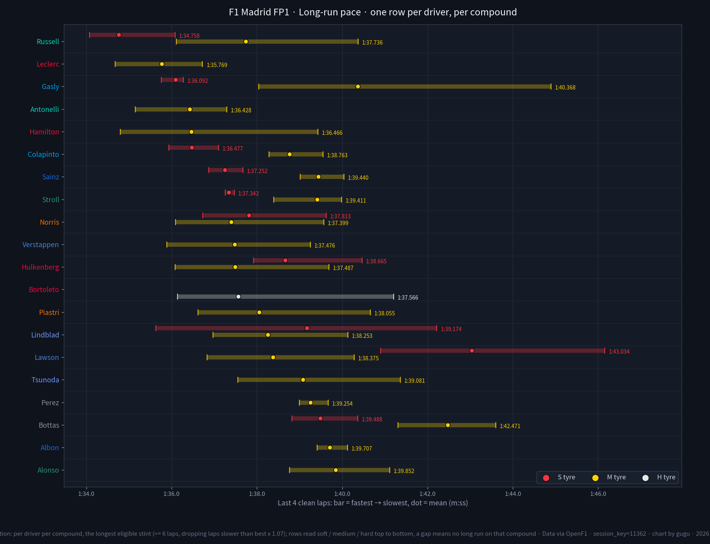
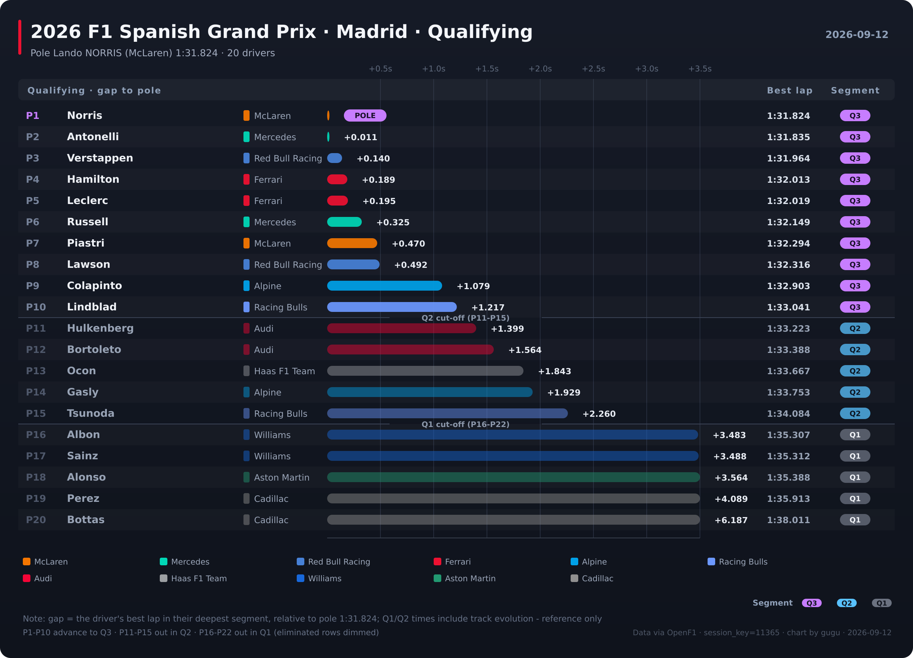
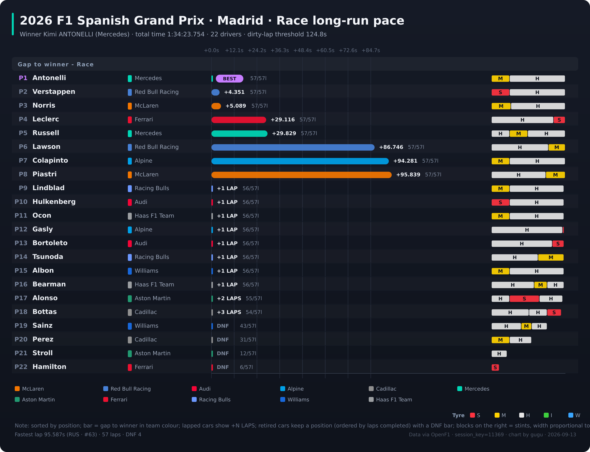

<div align="center">

# F1 Chart Toolkit

[中文](README.md) · [English](README.en.md)

</div>

---

## Showcase (Example: 2026 R16 Madrid)

| FP1 Lap-Gap (Ranking) | FP1 Degradation Trajectory | FP1 Long-Run Speed |
|---|---|---|
|  |  |  |

| Q Lap-Gap (Ranking) | Race Long-Run Pace |
|---|---|
|  |  |

> Legend: lap-gap charts show per-driver best lap time and gap to leader; long-run degradation trajectory shows per-car per-compound lap-by-lap drop-off (three panels: soft / medium / hard); long-run speed chart shows per-compound speed bars (soft/medium/hard three micro-layers, bar = TAIL=4 laps fastest→slowest at segment end); race pace chart shows per-car stint progress.


## Install & Usage

### Dependencies

| Dependency | Purpose | Install |
| --- | --- | --- |
| `ffmpeg` | SVG rasterization (librsvg backend) | `brew install ffmpeg` / `sudo apt install ffmpeg` |
| `Pillow` (PIL) | Python image library | `pip install Pillow` |
| `matplotlib` | Chart rendering | `pip install matplotlib` |
| `numpy` | Numerical computation | `pip install numpy` |

Python deps are listed in [requirements.txt](requirements.txt). The one-click install script [setup.sh](setup.sh) handles both Python deps and ffmpeg check.

> ⚠️ PNG is rendered via `ffmpeg + librsvg` native vector rasterization, not up-scaled from a lower-res bitmap. Without ffmpeg, PNG cannot be generated but SVG output still works.

### Quick Start

```bash
# 1. Clone the repo
git clone https://github.com/Coffeiz/f1-sheet-skill.git
cd f1-sheet-skill

# 2. Install dependencies (Python + ffmpeg check)
bash setup.sh

# 3. Fetch data → render charts
python3 f1_fetch.py 11362          # fetch R16 Madrid FP1 data
python3 f1_chart_fp.py 11362       # render FP1 lap-gap chart
python3 f1_chart_q.py 11365        # render qualifying lap-gap chart
python3 f1_chart_r.py 11369        # render race long-run pace chart
python3 f1_chart_long.py 11362     # render FP1 long-run speed chart
python3 f1_chart_long_traj.py 11362  # render FP1 degradation trajectory
```

Render an entire weekend in one go:

```bash
python3 f1_weekend.py --round 16              # fetch + render all sessions
python3 f1_weekend.py --round 16 --only FP1,Q # only specified sessions
python3 f1_weekend.py --round 16 --dry-run    # preview plan without touching anything
```

See 「各脚本」for more arguments.

## Detailed usage

All script arguments, definitions, gotchas, and the pre-ship checklist are in [SKILL.en.md](SKILL.en.md).

---

## Data source & disclaimer

- Data comes from [OpenF1](https://openf1.org/) (public API). This project only fetches and visualises it; it does not own the data.
- While a session is live, OpenF1 temporarily blocks unauthenticated global access (every endpoint returns 401) and restores it once the session ends.
- This project is not associated with Formula 1® the FIA, any team or any driver. "F1", "Formula 1" and related marks belong to their owners.
- Charts and conclusions are personal analysis, not official data.
