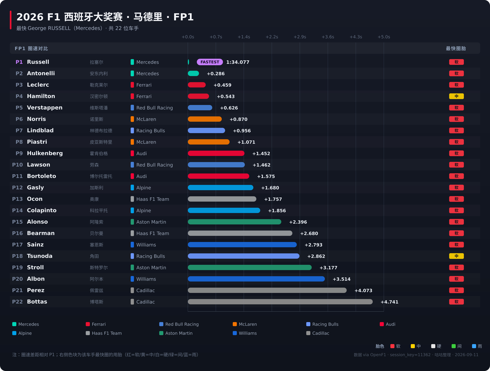
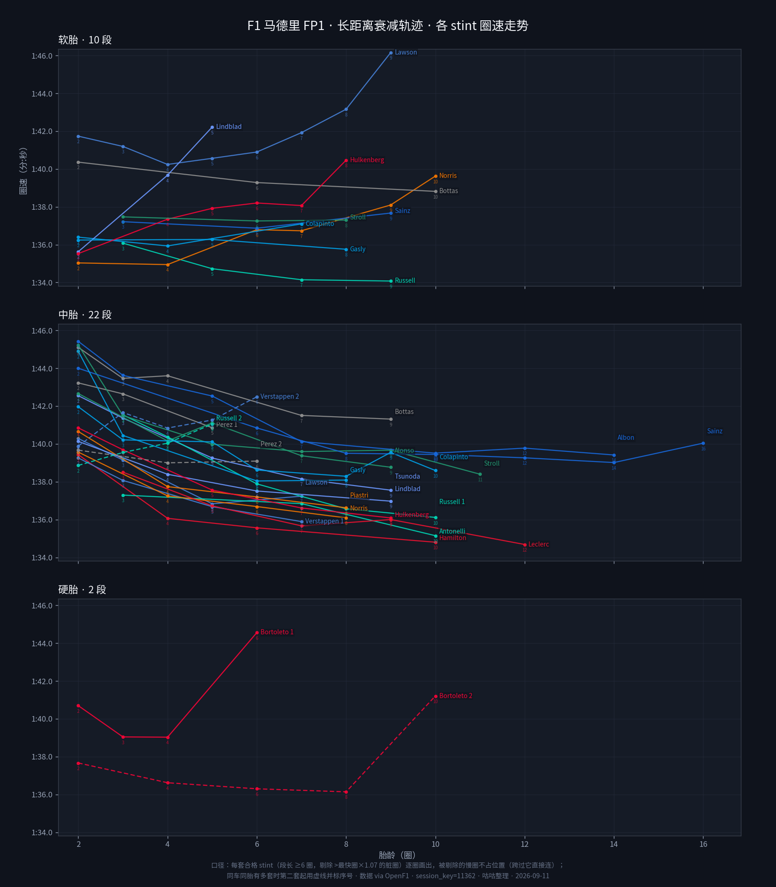
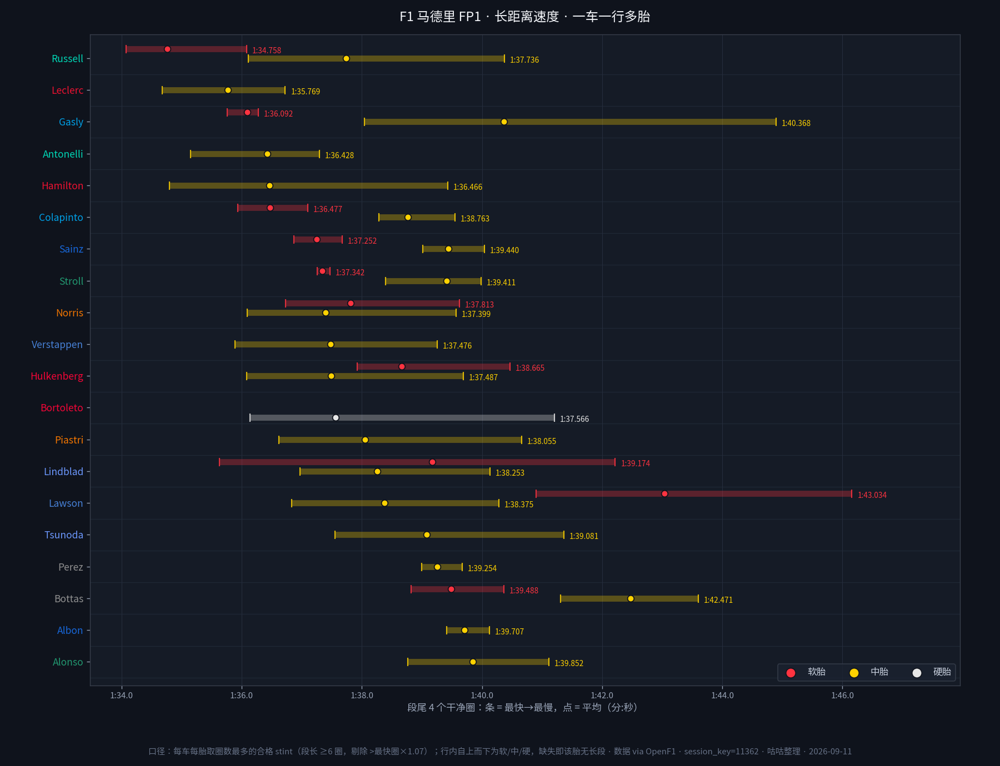
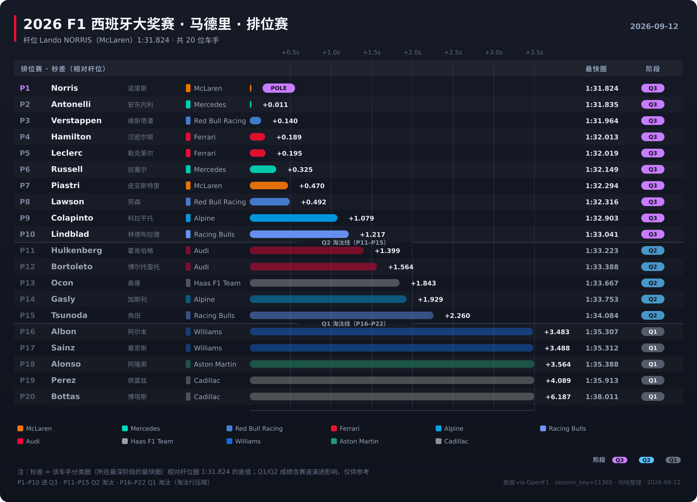
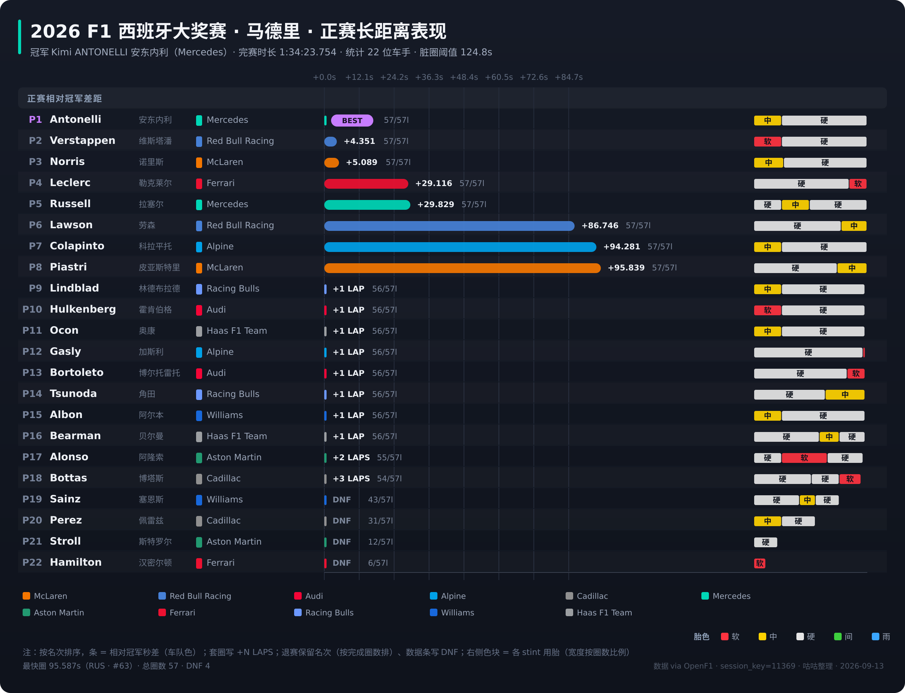

<div align="center">

# F1 数据图工具链

[中文](README.md) · [English](README.en.md)

</div>

---

## 效果展示（示例：2026 R16 马德里）

| FP1 圈速差距图（排名图） | FP1 长距离衰减轨迹图 | FP1 长距离速度图 |
|---|---|---|
|  |  |  |

| Q 排位圈速差距图 | 正赛长距离节奏图 |
|---|---|
|  |  |

> 图例：圈速差距图展示单圈排名与 gap；长距离衰减轨迹图展示各车手各套轮胎的逐圈掉速形状（软/中/硬三个 panel）；长距离速度图展示合格长跑段的末段速度条（软/中/硬三微层叠加，条 = 段尾 TAIL=4 圈最快→最慢，点 = 其平均）；正赛长距离图展示每车 stints 节奏。


## 安装与使用

### 依赖

| 依赖 | 用途 | 安装方式 |
| --- | --- | --- |
| `ffmpeg` | SVG 矢量栅格化（librsvg 后端） | `brew install ffmpeg` / `sudo apt install ffmpeg` |
| `Pillow` (PIL) | Python 图像库 | `pip install Pillow` |
| `matplotlib` | 图表渲染 | `pip install matplotlib` |
| `numpy` | 数值计算 | `pip install numpy` |

Python 依赖已汇总在 [requirements.txt](requirements.txt)。系统一键安装脚本 [setup.sh](setup.sh) 会自动安装依赖并检查 ffmpeg。

> ⚠️ PNG 通过 `ffmpeg + librsvg` 原生矢量栅格化，不是位图放大。没有 ffmpeg 时 PNG 无法生成，但 SVG 仍可正常产出。

### 快速上手

```bash
# 1. 克隆仓库
git clone https://github.com/Coffeiz/f1-sheet-skill.git
cd f1-sheet-skill

# 2. 安装依赖（Python + ffmpeg 检查）
bash setup.sh

# 3. 抓数据 → 出图
python3 f1_fetch.py 11362          # 抓 R16 马德里 FP1 数据
python3 f1_chart_fp.py 11362       # 出 FP1 圈速差距图
python3 f1_chart_q.py 11365        # 出排位赛圈速差距图
python3 f1_chart_r.py 11369        # 出正赛长距离节奏图
python3 f1_chart_long.py 11362     # 出 FP1 长距离速度图
python3 f1_chart_long_traj.py 11362  # 出 FP1 长距离衰减轨迹图
```

一次出齐一个周末的图：

```bash
python3 f1_weekend.py --round 16              # 整站全出（自动抓数 + 出图）
python3 f1_weekend.py --round 16 --only FP1,Q # 只出指定阶段
python3 f1_weekend.py --round 16 --dry-run    # 预览计划不动手
```

更多参数见「各脚本」章节。

## 详细用法

所有脚本的参数、口径约定、常见坑、自检清单等详细说明见 [SKILL.md](SKILL.md)。

---

## 数据来源与免责

- 数据来自 [OpenF1](https://openf1.org/)（公开 API），本项目只做抓取与可视化，不拥有数据。
- OpenF1 在 session 进行期间会对未认证用户临时限制全局访问（所有端点回 401），等该 session 结束自动恢复。
- 本项目与 Formula 1®、FIA、任何车队及车手均无关联；「F1」「Formula 1」及相关名称、标识的商标权归其所有者。
- 图与结论均为个人分析产出，非官方数据。
